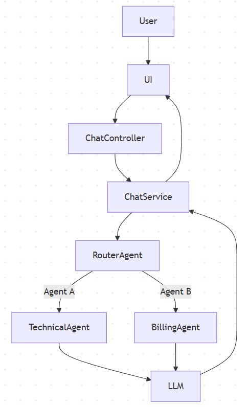
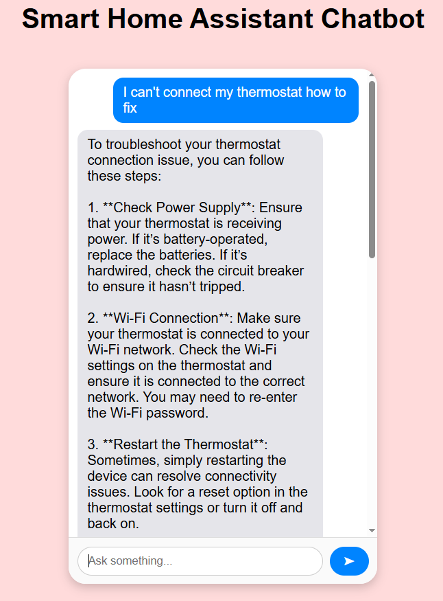

# Hello!

This repository contains my implementation for a smart home assistant coding task. The goal was to create a conversational AI that helps users manage and maintain smart home devices, specifically a Smart Doorlock and a Smart Thermostat.

The assistant consists of two collaborating agents:

- **Agent A (Technical Specialist):** Answers technical questions using documentation for each device, including user manuals, troubleshooting notes, and integration guides. The agent only provides answers backed by these documents, asking for clarification if the information is not available.

- **Agent B (Billing Specialist):** Handles billing-related queries, with capabilities such as explaining access to invoices, receipts, and statements, outlining the refund policy, sending refund templates, and providing tips for submitting refund requests.

When a user sends a message, the system automatically routes it to the most appropriate agent, ensuring the response comes from the agent best suited for the query.

More detailed technical information and architectural decisions can be found in the **System Overview** section below.

# System Overview

Once the application starts, the following steps happen in order:

### 1. Document Loading
- `DocumentLoader` reads documents from directories specified in the application properties.
- Each file is tokenized and split into **text segments**, which are later used for semantic search.

### 2. Embedding Creation
- `EmbeddingService` generates embeddings for each text segment.
- This process runs in a background thread using the OpenAI embedding model (`text-embedding-3-large`).
- Separate **vector stores** are created for Technical Agent (Agent A) and Billing Agent (Agent B), storing the embeddings for semantic search.

### 3. Prompt Handling / Agent Routing
- The application is ready to accept user prompts through the UI.
- Each prompt triggers a **POST request** to the controller (`ChatController`), which passes it to `ChatService`.
- `RouterAgent` evaluates which agent should handle the query by comparing the prompt embedding with each agent’s vector store using **cosine similarity**.
- If no agent is considered suitable, the system requests clarification from the user.

### 4. Agent Response Generation
- Once the appropriate agent is chosen, it retrieves the most relevant **document segments** from its vector store.
- These segments are converted back into text (retrieval after semantic search) and combined with the user’s prompt as context for the LLM.
- The agent calls the **LLM** (OpenAI `gpt-4o-mini`) with this context to generate a response.

### 5. Multi-Turn Memory Handling
- `LangChainConfig` defines a `ChatMemoryProvider` bean that creates a `MessageWindowChatMemory` for each session (`memoryId`) with a maximum of 10 messages stored.
- `ChatModel` interface handles LLM calls with `memoryId` and the user prompt (`@UserMessage`), ensuring conversation history is preserved across multiple turns.
- In the frontend (`app.js`), a unique `sessionId` is generated **once per chat session** (e.g., via `crypto.randomUUID()`) when the user opens the chat.
- It is sent as `memoryId` with each request, ensuring that the conversation history is preserved and tied to the same user session.

### 6. Response Delivery
- The generated answer is returned via the API to the UI and displayed in the chat window.
- Multi-turn conversations are supported, with session-specific memory maintained for context-aware responses.

---

This architecture ensures that the assistant provides accurate, context-aware answers, dynamically selecting the most suitable agent for each user query while maintaining conversation history per session.

# Diagram

# Screenshot from App

# Tech Stack

- **Backend Framework:** Spring Boot 3.5.6
- **Programming Language:** Java 21
- **Build Tool:** Gradle
- **LLM Integration:** LangChain4J 1.7.1
- **AI Provider:** OpenAI API (gpt-4o-mini for chat, text-embedding-3-large for embeddings)
- **Frontend:** HTML, CSS, JavaScript (for the chat UI)

# Setup

# Limitations

- Currently, the assistant only supports **Smart Doorlock** and **Smart Thermostat** devices. Other devices are not integrated yet.
- No list with historical chats with agent(like e.g. in ChatGPT).
- Multi-turn conversation memory is **stored in-memory** and resets after every application restart. This means chat history is lost when the server is stopped.