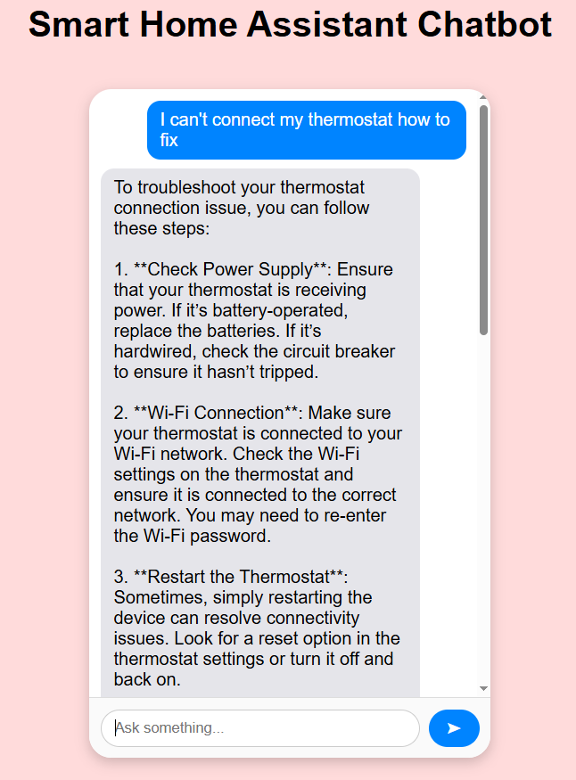

# Hello! :bowtie:

### Dear Recruiter,

As discussed the goal was to **implement a proper LLM tool-calling mechanism**.  
I have updated my implementation accordingly — making sure the system demonstrates how agents can effectively use tools through LLMs.  

### List of Changes
- Implemented **tool-calling** support across agents.
  > Added a dedicated **tools** module with mock implementations.  
  > The internal logic of these methods isn’t crucial — the goal was to clearly demonstrate the mechanism of tool invocation.  
  > Real database or API calls can be added later if needed.
- Each **Agent** now has its own chat model implementation. Why?
    >For example, the Technical Agent uses a model configured with its specific toolbox (the tool schema is included in the request JSON sent to the OpenAI API).


- **Example usage (Billing Agent):**  
  The assistant can be asked to list all invoices.  
  Once the list is retrieved (currently mocked as a hardcoded response), an invoice ID can be used to request more detailed information about a specific invoice.
  > This task is handled by the **Billing Agent**, which is equipped with tools for invoice retrieval, refund templates, and payment-related operations.

- **Example usage (Technical Agent):**  
  The assistant can be asked to set the thermostat temperature to a desired value.  
  *(This functionality is currently mocked — in the future, a boundary check such as `14 < desiredTemp < 30` could be added before applying the change.)*
  > The **Technical Agent** uses tools related to device control, diagnostics, and configuration management.
  
- Updated **Router logic** — now it calls the LLM to decide which agent should respond (as discussed).
- Router did not get any toolbox. It should not call any tools - just pick an agent.
- Reworked **LLM configuration management** — models are now configured manually.
  > Optionally, this could also be reflected directly in the `@AiService` annotation (similar to how the Router’s chat model interface works).
---

### Intro
This repository contains my implementation for a coding task. I decided that the requirements could be best fulfilled by implementing a system of smart home devices, so I designed and developed a Smart Home Assistant that manages a Smart Doorlock and a Smart Thermostat.

The assistant consists of two collaborating agents:

- **Agent A (Technical Specialist):** Answers technical questions using documentation or toolbox for each device, including user manuals, troubleshooting notes, and integration guides. The agent only provides answers backed by these sources, asking for clarification if the information is not available.

- **Agent B (Billing Specialist):** Handles billing-related queries, with capabilities such as giving access to invoices, explaining access to receipts, and statements, outlining the refund policy, sending refund templates and submitting filled sent templates generating an ID for a form. Agent can also provide tips for submitting refund requests.

When a user sends a message, the system automatically routes it to the most appropriate agent, ensuring the response comes from the agent best suited for the query.

More detailed technical information and architectural decisions can be found in the **System Overview** section below.

### :warning: Disclaimer

This implementation focuses on demonstrating the core functionality and mechanisms required by the assignment in a clean and transparent way.
The documentation for Smart Doorbell and Smart Thermostat was generated with ChatGPT-5 to simulate realistic device manuals and troubleshooting materials.
For this project, I chose **not to use a database**. The focus was on implementing the **core functionality and proper mechanisms**.
Persistent storage of vectors or session IDs was **not considered essential for fulfilling the assignment requirements**, but it would be a natural next step for building the application and improving scalability.

# System Overview

Once the application starts, the following steps happen in order:

### 1. Document Loading
- [DocumentLoader](src/main/java/com/smartaink/smart_home_assistant/utils/DocumentLoader.java) reads documents from directories specified in the application properties.
- Each file is tokenized and split into **text segments**, which are later used for semantic search.

### 2. Embedding Creation
- [EmbeddingService](src/main/java/com/smartaink/smart_home_assistant/llm/EmbeddingService.java) generates embeddings for each text segment.
- This process runs in a background thread using the OpenAI embedding model (`text-embedding-3-large`).
- Separate **vector stores** are created for Technical Agent (Agent A) and Billing Agent (Agent B), storing the embeddings for semantic search.

### 3. Toolbox Wiring
- Each agent has its own **toolbox**, containing tools relevant to its responsibilities.
- The **Technical Agent’s toolbox** includes utilities for device data lookup, diagnostics and more...
- The **Billing Agent’s toolbox** includes tools for retrieving invoice data, refund templates and more...
- Toolboxes are **initialized automatically at application startup**, when Spring creates and wires all beans.
  > Each LLM instance receives only the tools defined for its respective agent, ensuring clear separation of responsibilities.
### 4. Prompt Handling / Agent Routing
- The application is ready to accept user prompts through the UI.
- Each prompt triggers a **POST request** to the controller ([ChatController](src/main/java/com/smartaink/smart_home_assistant/controller/ChatController.java)), which passes it to [ChatService](src/main/java/com/smartaink/smart_home_assistant/service/ChatService.java).
- [RouterAgent](src/main/java/com/smartaink/smart_home_assistant/service/RouterAgent.java) evaluates which agent should handle the query by comparing the prompt embedding with each agent’s vector store using **cosine similarity**.
- If no agent is considered suitable, the system requests clarification from the user.

### 5. Agent Response Generation
- Once the appropriate agent is chosen, it retrieves the most relevant **document segments** from its vector store.
- These segments are converted back into text (retrieval after semantic search) and combined with the user’s prompt as context for the LLM by an agent.
- The agent calls the **LLM** (OpenAI `gpt-4o-mini`) with this context to generate a response.


### 6. Multi-Turn Memory Handling
- [LangChainConfig](src/main/java/com/smartaink/smart_home_assistant/config/LangChainConfig.java) defines a `ChatMemoryProvider` bean that creates a `MessageWindowChatMemory` for each session (`memoryId`) with a maximum of 10 messages stored.
- Implemented chat interfaces handles LLM calls with chat method with parameters `memoryId` and the user prompt (`@UserMessage`), ensuring conversation history is preserved across multiple turns.
- In the frontend ([app.js](src/main/resources/static/js/app.js)), a unique `sessionId` is generated **once per chat session** (e.g., via `crypto.randomUUID()`) when the user opens the chat.
- It is sent as `memoryId` with each request, ensuring that the conversation history is preserved and tied to the same user session.

### 7. Response Delivery
- The generated answer is returned via the API to the UI and displayed in the chat window.
- Multi-turn conversations are supported, with session-specific memory maintained for context-aware responses.

---

This architecture ensures that the assistant provides accurate, context-aware answers, dynamically selecting the most suitable agent for each user query while maintaining conversation history per session.

# Screenshot from App


# Tech Stack

- `Backend Framework:` Spring Boot 3.5.6
- `Programming Language:` Java 21 :coffee:
- `Build Tool:` Gradle
- `LLM Integration:` LangChain4J 1.7.1
- `AI Provider:` OpenAI API (gpt-4o-mini for chat, text-embedding-3-large for embeddings)
- `Frontend:` HTML, CSS, JavaScript (for the chat UI)

# Setup Instructions

Follow these steps to set up and run the Smart Home Assistant locally.

---

## Prerequisites

You will need these installed:

- **Java 21** – [Download Java 21](https://www.oracle.com/java/technologies/javase/jdk21-archive-downloads.html)
- **Gradle** – [Install Gradle](https://gradle.org/install/)
- **OpenAI API key** – [Get an API key](https://platform.openai.com/account/api-keys) for LLM functionality


Set the API key using one of the following methods:

**Option 1: Environment Variable (Recommended)**
Set the `OPENAI_API_KEY` environment variable:
```bash
export OPENAI_API_KEY=your-api-key-here  # On Linux/Mac
set OPENAI_API_KEY=your-api-key-here      # On Windows PowerShell
```

**Option 2: application.properties file**
Copy `application.properties.example` to `application.properties` and set your API key:
```bash
cp src/main/resources/application.properties.example src/main/resources/application.properties
```
Then edit `application.properties` and replace `${OPENAI_API_KEY:}` with your actual API key, or set the environment variable as shown above.

The properties file should be in [resources](src/main/resources).

## Clone the repo
```
git clone https://github.com/mswiatek12/smart-home-assistant.git
cd smart-home-assistant
```

## Build & Run the Application
On Windows:
```
.\gradlew build && .\gradlew bootRun
```
On Linux:
```
gradle build && gradle bootRun
```
The application will run by default at http://localhost:8080

Once on the site you can use the input field to communicate with the assistant or do it via curl sending a POST type request to http://localhost:8080/api/chat like:
```
curl -X POST http://localhost:8080/api/chat \
     -H "Content-Type: application/json" \
     -d '{"sessionId": "some number", "prompt": "your prompt"}'
```

# Limitations

- :warning: Currently, the assistant only supports **Smart Doorlock** and **Smart Thermostat** devices. Other devices are not integrated yet.
- :warning: No list with historical chats with agent(like e.g. in ChatGPT). If we open new session new sessionID is generated losing previous.
- :warning: Multi-turn conversation memory is **stored in-memory(not-DB)** and resets after every application restart. This means chat history is lost when the server is stopped.
- :warning: The refund form template is provided as a message from the chatbot for the user to fill out — it is not sent via email or any other channel.
